# Cloud Agent Architecture — Phase 3.0

## Dependency Diagram

The diagram shows cross-group module dependencies. Internal wiring within a group and universal dependencies on `shared`/`predef` are omitted to keep the view readable.

```mermaid
graph TD

  subgraph SHARED["Shared"]
    shared
    sharedCrypto
    sharedJson
    sharedTest
  end

  subgraph DID["DID"]
    didApi
    didCore
    prismNodeClient
  end

  subgraph PROTOCOLS["DIDComm Protocols"]
    protocolConnection
    protocolInvitation
    protocolIssueCredential
    protocolPresentProof
    protocolReportProblem
    protocolCoordinateMediation
    protocolLogin
    protocolRouting
    protocolTrustPing
    protocolRevocationNotification
    protocolDidExchange
  end

  subgraph DIDCOMM_INFRA["DIDComm Infrastructure"]
    didcommModels
    didcommResolver
    didcommVC
    didcommAgent
    didcommAgentDidcommx
    didcommApi
  end

  subgraph CREDENTIALS["Credentials"]
    credentialsCore
    credentialsAnoncreds
    credentialsVcJWT
    credentialsSDJWT
    credentialsPreX
    credentialsAnoncredsTest
    credentialsApi
  end

  subgraph CREDENTIALS_HTTP["Credentials HTTP"]
    credentialDefinitionHttp
    credentialSchemaHttp
    credentialStatusHttp
    issueHttp
    presentProofHttp
    prexHttp
    verificationHttp
  end

  subgraph CONNECTIONS["Connections"]
    connectionsCore
    connectionsApi
    connectionsHttp
    connectionsPersistenceDoobie
  end

  subgraph WALLET["Wallet"]
    walletManagement
    walletManagementApi
    walletPersistenceDoobie
    walletSecretsVault
  end

  subgraph NOTIFICATIONS["Notifications"]
    notifications
    notificationsApi
    notificationsHttp
    notificationsWebhook
  end

  subgraph IAM["IAM"]
    iamCore
    iamEntityHttp
    iamWalletHttp
  end

  subgraph OID4VCI["OID4VCI"]
    oid4vciCore
    oid4vciHttp
  end

  subgraph VDR["VDR"]
    vdrApi
    vdrCore
    vdrBlockfrost
    vdrDatabase
    vdrMemory
    vdrPrismNode
    vdrProxy
    vdrService
    vdrHttp
  end

  subgraph API_SERVER["API Server"]
    apiServer
    apiServerConfig
    apiServerHttpCore
    apiServerControllerCommons
    systemHttp
  end

  subgraph BG_JOBS["Background Jobs"]
    apiServerJobsCore
    apiServerJobsConnect
    apiServerJobsIssue
    apiServerJobsPresent
    apiServerJobsStatusList
    apiServerJobsDidSync
  end

  subgraph DIDCOMM_HTTP["DIDComm HTTP"]
    didcommHttp
  end

  %% ── DID ──────────────────────────────────────────────────────────────────
  didApi --> prismNodeClient
  didCore --> didApi
  didCore --> prismNodeClient

  %% ── DIDComm Protocols → DIDComm Infrastructure ───────────────────────────
  protocolConnection --> didcommModels
  protocolConnection --> protocolInvitation
  protocolCoordinateMediation --> didcommModels
  protocolDidExchange --> didcommModels
  protocolDidExchange --> protocolInvitation
  protocolInvitation --> didcommModels
  protocolIssueCredential --> didcommModels
  protocolIssueCredential --> protocolInvitation
  protocolLogin --> didcommModels
  protocolPresentProof --> didcommModels
  protocolPresentProof --> protocolInvitation
  protocolReportProblem --> didcommModels
  protocolRevocationNotification --> didcommModels
  protocolRouting --> didcommModels
  protocolTrustPing --> didcommModels

  %% ── DIDComm Infrastructure internal cross-links ──────────────────────────
  didcommResolver --> didcommModels
  didcommVC --> protocolIssueCredential
  didcommVC --> protocolPresentProof
  didcommAgent --> didcommModels
  didcommAgent --> didcommResolver
  didcommAgent --> didcommVC
  didcommAgent --> protocolConnection
  didcommAgent --> protocolCoordinateMediation
  didcommAgent --> protocolInvitation
  didcommAgent --> protocolIssueCredential
  didcommAgent --> protocolLogin
  didcommAgent --> protocolPresentProof
  didcommAgent --> protocolReportProblem
  didcommAgent --> protocolRevocationNotification
  didcommAgent --> protocolRouting
  didcommAgent --> protocolTrustPing
  didcommAgentDidcommx --> didcommAgent
  didcommApi --> didcommModels

  %% ── Credentials → DID ────────────────────────────────────────────────────
  credentialsVcJWT --> didApi
  credentialsCore --> didApi
  credentialsApi --> didApi

  %% ── Credentials → DIDComm Infrastructure ────────────────────────────────
  credentialsCore --> didcommAgentDidcommx
  credentialsCore --> didcommResolver
  credentialsApi --> didcommApi

  %% ── Credentials → DIDComm Protocols ──────────────────────────────────────
  credentialsCore --> protocolIssueCredential
  credentialsCore --> protocolPresentProof

  %% ── Credentials → Wallet ─────────────────────────────────────────────────
  credentialsCore --> walletManagement
  credentialsCore --> walletManagementApi

  %% ── Credentials → Notifications ──────────────────────────────────────────
  credentialsCore --> notifications

  %% ── Connections → DIDComm Protocols ──────────────────────────────────────
  connectionsCore --> protocolConnection
  connectionsCore --> protocolReportProblem

  %% ── Connections → Notifications ──────────────────────────────────────────
  connectionsCore --> notifications

  %% ── Connections → DIDComm Infrastructure ─────────────────────────────────
  connectionsApi --> didcommApi

  %% ── Wallet → DID ─────────────────────────────────────────────────────────
  walletManagement --> didApi
  walletManagement --> didcommResolver
  walletManagement --> walletManagementApi

  %% ── Wallet → Notifications ───────────────────────────────────────────────
  walletManagement --> notifications

  %% ── Notifications internal ───────────────────────────────────────────────
  notifications --> notificationsApi

  %% ── OID4VCI → DID / Credentials ─────────────────────────────────────────
  oid4vciCore --> credentialsVcJWT
  oid4vciCore --> didApi
  oid4vciHttp --> credentialsCore
  oid4vciHttp --> iamCore
  oid4vciHttp --> oid4vciCore
  oid4vciHttp --> walletManagement
  oid4vciHttp --> apiServerHttpCore

  %% ── VDR → DID ────────────────────────────────────────────────────────────
  vdrCore --> prismNodeClient
  vdrPrismNode --> didApi
  vdrPrismNode --> prismNodeClient

  %% ── VDR HTTP → API Server ────────────────────────────────────────────────
  vdrHttp --> apiServerHttpCore

  %% ── VDR Service → VDR internals ──────────────────────────────────────────
  vdrService --> prismNodeClient

  %% ── IAM → API Server / Wallet ────────────────────────────────────────────
  iamCore --> apiServerHttpCore
  iamCore --> walletManagement
  iamEntityHttp --> apiServerHttpCore
  iamEntityHttp --> iamCore
  iamEntityHttp --> walletManagement
  iamWalletHttp --> apiServerHttpCore
  iamWalletHttp --> iamCore
  iamWalletHttp --> walletManagement

  %% ── Credentials HTTP → API Server ────────────────────────────────────────
  credentialDefinitionHttp --> apiServerHttpCore
  credentialDefinitionHttp --> credentialsCore
  credentialDefinitionHttp --> walletManagement
  credentialSchemaHttp --> apiServerHttpCore
  credentialSchemaHttp --> credentialsCore
  credentialSchemaHttp --> walletManagement
  credentialStatusHttp --> apiServerHttpCore
  credentialStatusHttp --> credentialsCore
  issueHttp --> apiServerControllerCommons
  issueHttp --> credentialsCore
  presentProofHttp --> apiServerControllerCommons
  presentProofHttp --> credentialsCore
  prexHttp --> apiServerHttpCore
  prexHttp --> credentialsCore
  prexHttp --> credentialsPreX
  verificationHttp --> apiServerHttpCore
  verificationHttp --> credentialsCore

  %% ── Connections HTTP → API Server / Connections ───────────────────────────
  connectionsHttp --> apiServerHttpCore
  connectionsHttp --> connectionsApi
  connectionsHttp --> walletManagement

  %% ── Notifications HTTP → API Server ──────────────────────────────────────
  notificationsHttp --> apiServerHttpCore
  notificationsHttp --> notifications
  notificationsHttp --> walletManagement
  notificationsWebhook --> apiServerConfig
  notificationsWebhook --> connectionsCore
  notificationsWebhook --> credentialsCore
  notificationsWebhook --> notificationsApi
  notificationsWebhook --> walletManagement

  %% ── DIDComm HTTP ──────────────────────────────────────────────────────────
  didcommHttp --> apiServerHttpCore
  didcommHttp --> connectionsApi
  didcommHttp --> credentialsApi
  didcommHttp --> didcommAgent
  didcommHttp --> didcommAgentDidcommx
  didcommHttp --> walletManagement

  %% ── API Server ────────────────────────────────────────────────────────────
  apiServerHttpCore --> walletManagementApi
  apiServerControllerCommons --> apiServerHttpCore
  apiServerControllerCommons --> connectionsCore
  apiServerControllerCommons --> credentialsCore
  apiServerControllerCommons --> didApi
  apiServerControllerCommons --> didcommModels
  apiServerControllerCommons --> walletManagement
  apiServerConfig --> apiServerHttpCore
  apiServerConfig --> iamCore

  %% ── Background Jobs ───────────────────────────────────────────────────────
  apiServerJobsCore --> apiServerConfig
  apiServerJobsCore --> credentialsCore
  apiServerJobsCore --> credentialsVcJWT
  apiServerJobsCore --> didApi
  apiServerJobsCore --> didcommAgent
  apiServerJobsCore --> didcommAgentDidcommx
  apiServerJobsCore --> walletManagement
  apiServerJobsConnect --> apiServerJobsCore
  apiServerJobsConnect --> connectionsCore
  apiServerJobsIssue --> apiServerJobsCore
  apiServerJobsIssue --> credentialsAnoncreds
  apiServerJobsIssue --> credentialsCore
  apiServerJobsIssue --> credentialsSDJWT
  apiServerJobsIssue --> credentialsVcJWT
  apiServerJobsPresent --> apiServerJobsCore
  apiServerJobsPresent --> credentialsAnoncreds
  apiServerJobsPresent --> credentialsCore
  apiServerJobsPresent --> credentialsSDJWT
  apiServerJobsPresent --> credentialsVcJWT
  apiServerJobsPresent --> didApi
  apiServerJobsStatusList --> apiServerJobsCore
  apiServerJobsStatusList --> credentialsCore
  apiServerJobsStatusList --> credentialsVcJWT
  apiServerJobsDidSync --> apiServerJobsCore

  %% ── Top-level apiServer wiring ────────────────────────────────────────────
  apiServer --> apiServerConfig
  apiServer --> apiServerControllerCommons
  apiServer --> apiServerHttpCore
  apiServer --> apiServerJobsConnect
  apiServer --> apiServerJobsDidSync
  apiServer --> apiServerJobsIssue
  apiServer --> apiServerJobsPresent
  apiServer --> apiServerJobsStatusList
  apiServer --> connectionsCore
  apiServer --> connectionsHttp
  apiServer --> connectionsPersistenceDoobie
  apiServer --> credentialDefinitionHttp
  apiServer --> credentialSchemaHttp
  apiServer --> credentialStatusHttp
  apiServer --> credentialsCore
  apiServer --> didCore
  apiServer --> didcommHttp
  apiServer --> iamCore
  apiServer --> iamEntityHttp
  apiServer --> iamWalletHttp
  apiServer --> issueHttp
  apiServer --> notificationsHttp
  apiServer --> notificationsWebhook
  apiServer --> oid4vciCore
  apiServer --> oid4vciHttp
  apiServer --> presentProofHttp
  apiServer --> prexHttp
  apiServer --> systemHttp
  apiServer --> vdrHttp
  apiServer --> vdrService
  apiServer --> verificationHttp
  apiServer --> walletManagement
```

## Legend

| Group | Description |
|---|---|
| **Shared** | Low-level utilities (crypto, JSON, test helpers) used by almost every module |
| **DID** | DID resolution, PRISM node client, and core DID operations |
| **DIDComm Protocols** | Pure data / message models for each DIDComm protocol variant |
| **DIDComm Infrastructure** | Agent runtime, VC envelope, resolver, and DIDCommx adapter |
| **Credentials** | Core credential business logic, format drivers (JWT, SDJWT, Anoncreds, PEX) and API layer |
| **Credentials HTTP** | REST controllers for credential schema, definition, status, issuance, presentation, PEX, and verification |
| **Connections** | Connection record management, persistence, and REST controllers |
| **Wallet** | Wallet management, API surface, Doobie persistence, and Vault secret storage |
| **Notifications** | Event notification core, API, REST, and webhook delivery |
| **IAM** | Identity & access management core, entity HTTP, and wallet HTTP controllers |
| **OID4VCI** | OpenID for Verifiable Credential Issuance — core logic and HTTP controllers |
| **VDR** | Verifiable Data Registry — pluggable drivers (Blockfrost, PrismNode, Memory, DB), proxy, service, and HTTP |
| **API Server** | HTTP server bootstrap, shared HTTP core, controller commons, configuration, and system health endpoint |
| **Background Jobs** | Long-running job runners for connections, issuance, presentation, status-list, and DID sync |
| **DIDComm HTTP** | HTTP endpoint that dispatches inbound DIDComm messages to the agent runtime |
