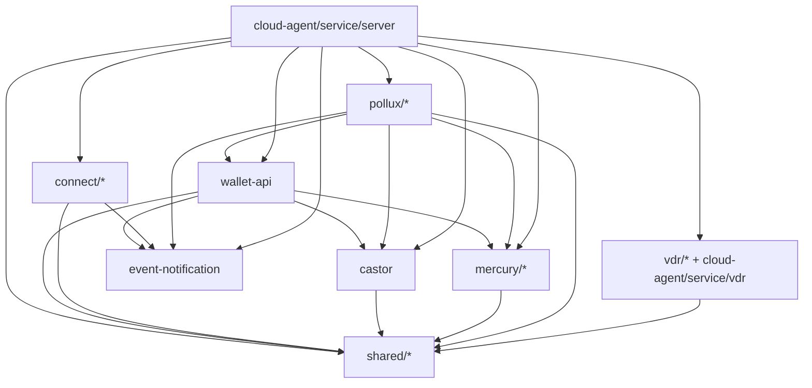
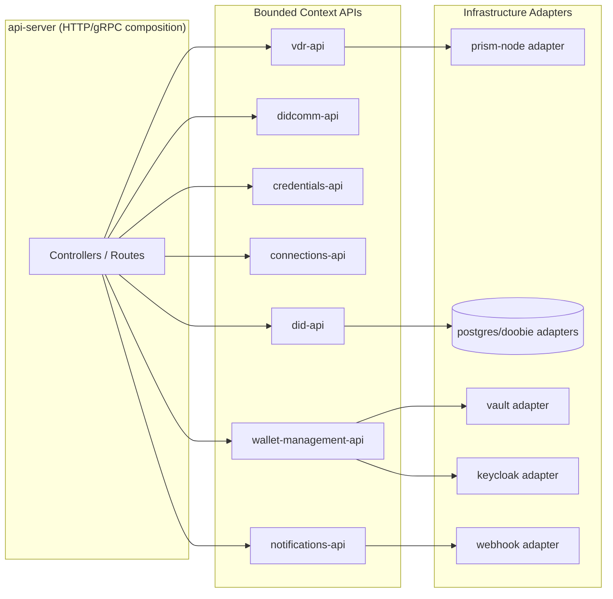
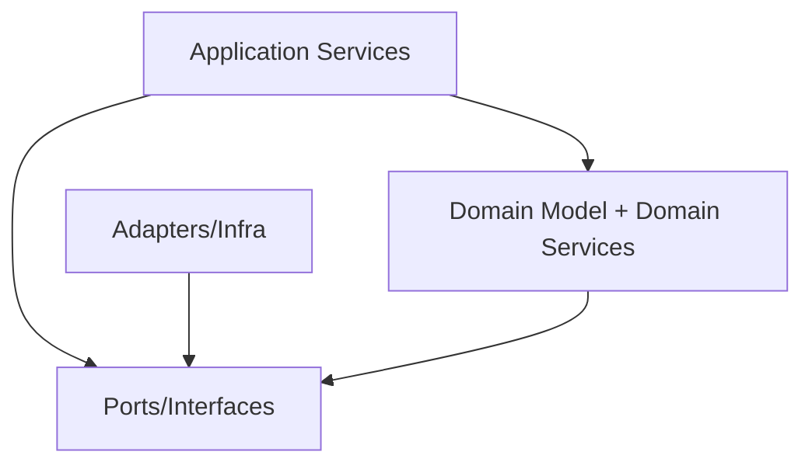
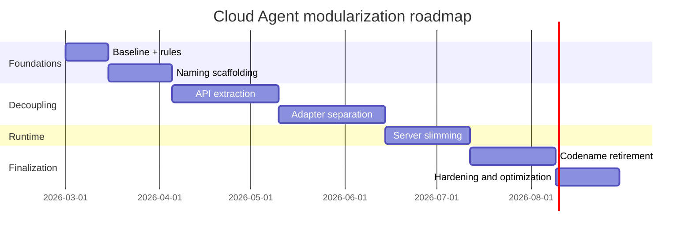

# Cloud Agent Modular Architecture Refactor Blueprint

## Status

- Proposal
- Scope: `hyperledger-identus/cloud-agent`
- Primary goals:
  - Reduce compile-time and runtime coupling.
  - Move from code-name-centric modules (`mercury`, `pollux`, `castor`, etc.) to domain language.
  - Make module boundaries explicit, testable, and evolvable.

## 1. Problem Statement

The current codebase has strong functional value but architecture is harder to evolve than it should be:

- Some core modules depend on many other domains directly (especially around credential and DIDComm orchestration).
- Domain language in module names is inconsistent (`pollux`, `mercury`, `castor`, `connect`, etc.), which makes onboarding and ownership mapping harder.
- `shared/*` has grown into a broad dependency surface, increasing accidental coupling.
- The server composition layer is still a central coupling hotspot.

## 2. Design Principles

1. `Domain-first naming`

- Module and package names should describe business capabilities, not codenames.

1. `Ports and adapters at context boundaries`

- Each bounded context exposes a small API (ports) and keeps infra-specific logic in adapters.

1. `Compile-time dependency direction`

- High-level policy depends on abstractions, adapters depend on context APIs.

1. `Incremental migration`

- Preserve compatibility while introducing aliases and moving one context at a time.

1. `Test strategy aligned with boundaries`

- Unit tests for context logic.
- Contract tests for cross-context interactions.
- A thin set of integration tests for composed runtime behavior.

## 3. Naming Strategy (Codename -> Domain)

The goal is not to break everything at once; it is to converge naming in phases.

| Current Name | Proposed Domain Name | Rationale |
| --- | --- | --- |
| `mercury` | `didcomm` | Contains DIDComm protocols, agent/resolver behavior. |
| `pollux` | `credentials` | Contains credential issuance/presentation/JWT/AnonCreds concerns. |
| `castor` | `did` (or `did-registry`) | Owns DID lifecycle and DID-related registry operations. |
| `connect` | `connections` | Focused on connection/session workflows. |
| `event-notification` | `notifications` | Outbound events/webhooks. |
| `cloud-agent/service/wallet-api` | `wallet-management` | Wallet-facing identity/key operations. |
| `cloud-agent/service/server` | `api-server` | Runtime composition and HTTP API hosting. |
| `apollo` (external codename in imports) | `crypto` (first-level module) | Keep `apollo` as an external dependency, but expose domain-facing ports/facades behind an internal `crypto` module. |

### Migration policy for names

- Keep old sbt project IDs temporarily for compatibility if needed.
- Introduce new directory/package naming and aliases.
- Add deprecation notices in old package paths.
- Remove old names only after one full release cycle (or when major version policy allows).

## 4. Target Bounded Contexts

Proposed bounded contexts:

- `didcomm`
- `credentials`
- `did`
- `wallet-management`
- `connections`
- `vdr`
- `notifications`
- `crypto` (facade over `apollo`; key ops, signing, verification)
- `iam-authz`
- `api-server` (composition + transport only)
- `core` (small, stable primitives only — ids, errors, JSON, testkit)

## 5. Architecture Diagrams

### 5.1 Current high-level coupling (simplified)



### 5.2 Target architecture (ports/adapters)



### 5.3 Enforced dependency direction



Rule:

- `Domain` must not import adapter implementations.
- `Application` orchestrates via ports only.

## 6. Proposed Module Layout

Target layout (logical):

```text
modules/
  core/
    primitives
    json
    testkit

  crypto/
    api
    apollo-adapter

  did/
    api
    domain
    persistence-doobie
    prism-node-adapter

  didcomm/
    api
    protocols
    agent
    resolver

  credentials/
    api
    domain
    jwt
    sd-jwt
    anoncreds
    persistence-doobie

  connections/
    api
    domain
    persistence-doobie

  vdr/
    api
    core
    memory-adapter
    database-adapter
    prism-node-adapter
    blockfrost-adapter
    http

  notifications/
    api
    domain
    webhook-adapter

  wallet-management/
    api
    domain
    iam-keycloak-adapter
    secrets-vault-adapter

  api-server/
    bootstrap
    http
```

Note: this can be implemented with existing top-level directories first; physical relocation can follow once boundaries are stable.

## 7. Coupling Reduction Tactics

1. `Introduce context APIs`

- For each context, define a thin `*-api` module with service contracts and DTOs.
- Replace direct domain-to-domain concrete dependencies with API dependencies.

1. `Split orchestration from domain`

- Keep business invariants in domain modules.
- Move workflow composition to application services.

1. `Keep core minimal`

- Only keep stable primitives in `core` (ids, errors, serialization helpers that are truly generic).
- Move domain-specific helpers out of `core` into their owning context.
- `crypto` is a first-level context, not a `core` sub-module — it owns the `apollo` facade and all key/signing abstractions.

1. `Isolate external systems`

- Prism Node, Blockfrost, Keycloak, Vault, DBs behind adapters.
- Keep anti-corruption mapping at adapter edge.

1. `Add architectural fitness checks`

- Automated checks to prevent forbidden module imports.
- Build fails when dependency direction is violated.

## 8. Migration Plan (Phased)

### Phase 0: Baseline and guardrails

- Deliverables:
  - Current dependency graph snapshot.
  - Architectural constraints document.
  - CI check for forbidden cross-context dependencies (initially report-only).

### Phase 1: Naming alignment scaffolding

- Deliverables:
  - Domain glossary.
  - New module aliases (`didcomm`, `credentials`, `did`, `connections`) mapped to existing modules.
  - Deprecation annotations for codename-facing entry points where feasible.

### Phase 2: API extraction per context

- Deliverables:
  - `did-api`, `credentials-api`, `didcomm-api`, `connections-api`, `wallet-management-api`, `notifications-api`.
  - Existing modules switch to API imports where cross-context interaction exists.

### Phase 3: Adapter separation

- Deliverables:
  - Explicit adapter modules for `prism-node`, `blockfrost`, `keycloak`, `vault`, `doobie`.
  - Domain modules no longer import external client libraries directly.

### Phase 4: Server slimming

- Deliverables:
  - `api-server` only composes context APIs and adapters.
  - Remove business logic leakage from controllers/modules wiring.

### Phase 5: Package move and codename retirement

- Deliverables:
  - Directory/package migration from codenames to domain names.
  - Backward compatibility shims removed (major/minor release policy dependent).

### Phase 6: Optimization and hardening

- Deliverables:
  - Build parallelism and test matrix tuned per context.
  - Ownership map + CODEOWNERS aligned to contexts.

## 9. Suggested Timeline



## 10. Risks and Mitigations

| Risk | Impact | Mitigation |
| --- | --- | --- |
| Boundary extraction introduces behavior regressions | High | Contract tests between old/new paths, gradual cutover flags |
| Over-fragmentation into too many tiny modules | Medium | Start with logical boundaries, merge where low value |
| Naming migration churn for contributors | Medium | Alias period + clear migration guides |
| CI time increase during transition | Medium | Per-context test jobs + targeted test selection |
| Hidden runtime coupling discovered late | High | Add integration smoke tests for critical flows per phase |

## 11. Success Metrics

- `Dependency`:
  - 40% reduction in cross-context compile dependencies (baseline from Phase 0).
  - Zero forbidden imports after rule enforcement.

- `Delivery`:
  - Faster targeted builds/tests (`sbt project/<context> test`) with predictable ownership.

- `Code health`:
  - Fewer architectural code smells in PR reviews.
  - Lower duplication and lower incidental complexity around server composition.

## 12. First Iteration Backlog (Recommended)

1. Create architecture glossary and publish it in `docs/research`.
2. Introduce API modules for `did`, `credentials`, `didcomm`, `connections`.
3. Add CI architectural check (report mode) for forbidden dependencies.
4. Extract remaining external integrations behind adapters where missing.
5. Move server wiring to use only context APIs.

## 13. Naming Glossary (for contributors)

- `did`: DID lifecycle, resolution, state transitions.
- `didcomm`: DIDComm protocol messages, state machines, transport-level interaction.
- `credentials`: issuance, verification, revocation, presentation.
- `connections`: peer relationships and protocol-level connection state.
- `wallet-management`: managed DID/key/tenant and IAM integration.
- `vdr`: verifiable data registry operations and driver integrations.
- `notifications`: webhook/event delivery abstractions and adapters.
- `crypto`: cryptographic operations (key generation, signing, verification) — facade over `apollo`.
- `core`: stable cross-cutting primitives (identifiers, error types, JSON utilities, testkit helpers).
